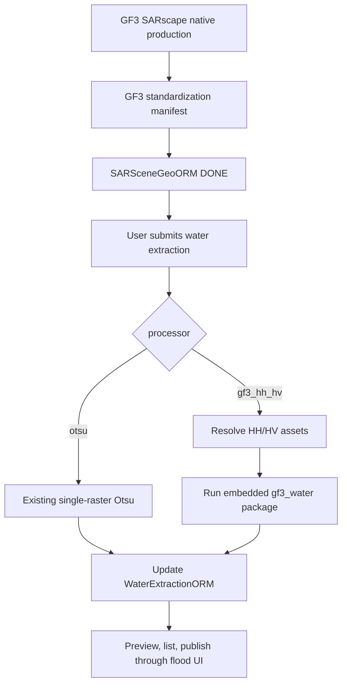

# GF3 Water Extraction Integration Design

Date: 2026-06-15

## Scope

This document describes how to embed the GF-3 HH/HV water extraction work from `D:\Code\Water` into the management system.

The goal is integration, not bulk import. Code that is reusable should be copied into the backend; code that is workflow-specific should be rewritten around the existing job system; large data and generated products should be transferred or registered as runtime assets outside Git.

## Source Project Inventory

`D:\Code\Water` contains:

- `gf3_water/`: active Python package for GF-3 HH/HV water extraction.
- `scripts/`: thin CLI/data-preparation wrappers.
- `docs/`: algorithm and integration notes.
- `data/`: local scenes and prior data from the experiment workspace.
- `outputs/`: generated products.
- `gf3-water-ai4g-unet/`: legacy deep-learning experiment/checkpoints.

The active production-facing implementation is the non-DL `gf3_water` package. It consumes SARscape ENVI HH/HV geocoded assets, for example `_hh_geo` and `_hv_geo`, and writes raster, preview, vector and `metadata.json` outputs.

Production policy:

- Do not use DLTB, hydro, water-vector or paddy-vector priors.
- Do not use deep-learning checkpoints or U-Net inference.
- Use the current HH/HV machine-learning-style threshold, candidate and morphology workflow.

## Current System Entry Points

The existing system already has a suitable production chain:

1. `/flood/water-extractions` creates a `WaterExtractionORM` record.
2. The record is submitted as a `WATER_DETECT` job.
3. `backend/app/services/job_handlers.py::_handle_water_detect` runs the processor.
4. Results are written back to `WaterExtractionORM`.
5. `FloodAnalysisWorkspace.jsx` lists and previews extraction results.

The GF-3 HH/HV processor should be embedded into this chain instead of creating a parallel table or router.

## Copy, Rewrite, Transfer

### Copy Into The Backend

Copy the reusable algorithm package:

- From: `D:\Code\Water\gf3_water`
- To: `backend/app/processors/gf3_water`

The copied package should remain close to the original algorithm code so it can be compared and upgraded later. System-specific behavior should live in a separate service wrapper.

Optional later copy:

- `D:\Code\Water\scripts\water_baseline_hh_hv.py` only if a local CLI smoke-test entry is needed.

Do not copy:

- `outputs/`
- `data/scenes/`
- `data/raw/`
- `gf3-water-ai4g-unet/*.pt`

### Rewrite In The System

System integration should be written around existing services:

- Add a backend wrapper service, for example `backend/app/services/gf3_water_extraction_service.py`.
- Extend `/flood/water-extractions` request schema with:
  - `processor`
  - `hh_path`
  - `hv_path`
  - `processor_params`
- Add HH/HV asset resolution from `SARSceneGeoORM.analysis_metadata_json.standard_assets` or the related `RadarDataORM.metadata_json.standard_assets`.
- Dispatch `WATER_DETECT` by `processor`:
  - `otsu`: keep existing single-raster processor.
  - `gf3_hh_hv`: run the embedded GF-3 HH/HV package.
- Map GF-3 outputs into `WaterExtractionORM`:
  - `output_path`: prefer `cartographic_water.tif`, fallback `water_mask.tif`.
  - `preview_path`: prefer `preview_overlay.png`, fallback `classified_preview.png`.
  - `vector_path`: prefer `shp/cartographic_water.shp`, fallback `water_products.gpkg`.
  - `water_pixel_count`: prefer `cartographic_water_pixels` when cartographic output is enabled.
  - `threshold_value`: `score_threshold`.
  - `metadata_json`: original metadata plus resolved input/output paths and processor version.
- Update frontend water extraction UI:
  - Processor selector: fast Otsu vs GF-3 HH/HV.
  - For GF-3 HH/HV, show whether HH/HV assets are auto-resolved for the selected scene.
  - Allow manual HH/HV paths for early operations and debugging.
  - Display processor/output type in result rows.

### Transfer Or Register As Runtime Assets

Do not store runtime data in Git.

Current integration does not use DLTB priors. The GF-3 HH/HV processor runs from SAR backscatter, morphology and optional vector/DEM inputs only.

Not transferred:

- `D:\Code\Water\data\priors\dltb_cache\heilongjiang`
  - Current size observed: 25 files, about 8.5 GB.
- Hydro prior vectors under `data/priors/hydro`.
- Water/paddy vector priors.

Optional runtime asset:

- DEM path if slope filtering should be enabled.

Build-only assets:

- `data/raw/dltb/DLTB_2025.gdb`
- Heilongjiang boundary Shapefile used by cache-build scripts.

These are only needed to rebuild the DLTB cache and should be kept in external storage.

Legacy DL assets:

- `gf3-water-ai4g-unet/best.pt`
- `gf3-water-ai4g-unet/last.pt`

These are large model artifacts and should stay outside the application until a separate model registry/runtime is designed.

## Recommended Runtime Configuration

Add configuration keys:

- `GF3_WATER_DEM_PATH`
- `GF3_WATER_DEFAULT_CARTOGRAPHIC=true`
- `GF3_WATER_DEFAULT_OUT_VECTOR=true`

`WATER_RESULTS_DIR` remains the output root for generated extraction products.

## Production Workflow

## Implementation Order

1. Copy `gf3_water` package into `backend/app/processors/gf3_water`.
2. Add GF-3 HH/HV wrapper service and output mapping.
3. Add config keys and `.env.example` entries.
4. Extend request schema and submission metadata.
5. Add processor dispatch in `WATER_DETECT`.
6. Add HH/HV auto-resolution from standard GF3 assets.
7. Update frontend extraction controls/result display.
8. Verify with backend compile/import checks and frontend build.

## Open Decisions

- Whether runtime execution should be in-process Python API first or always subprocess CLI. Initial integration should use in-process API because it fits the existing worker model and keeps job accounting simple.
- DLTB, hydro, water-vector and paddy-vector priors are not part of the current workflow.
- Legacy AI4G U-Net/deep-learning checkpoints are not part of the current workflow.
