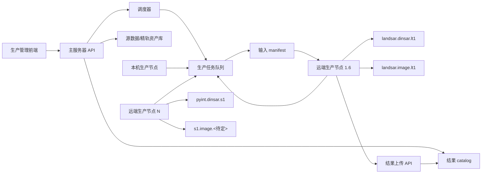

# 生产节点子系统设计：D-InSAR 与单景影像生产（2026-06-27）

## 1. 结论

当前 `LANDSAR_CLUSTER_ITEM` 已经证明：LandSAR D-InSAR 可以从主服务器拆分 pair，并在远端 Windows 节点完成输入搬运、LandSAR 执行和结果回传。

但这仍是 LandSAR D-InSAR 的集群 MVP，不应直接扩展成长期架构。后续陆探一号和 Sentinel-1 的“只生产影像、不做 D-InSAR”能力也会进入生产管理域。陆探一号这条线应优先承认 LandSAR 已有的 `100016` LT-1 数据导入/统一格式转换能力，再决定是否继续扩展为地理编码或正射影像产品。因此远端节点不能只理解 `LANDSAR_CLUSTER_ITEM`，而应该抽象成一个受控的“生产节点子系统”。

建议把后续设计目标调整为：

1. 主服务器继续负责资产索引、任务编排、调度策略、结果 catalog 和权限边界。
2. 子服务器只部署生产节点运行包，不部署完整项目仓库、前端、管理后台和无关源码。
3. 所有生产任务按“产品类型 + 处理器能力”分发，同一任务可以选择本机执行或集群执行。
4. LandSAR、Gamma/PyINT、未来 Sentinel-1 影像生产处理器都通过 adapter 接入生产节点协议。
5. 结果以标准产品 manifest 回传，由主服务器统一入库，而不是让子服务器直接写主库或扫描任意目录。

## 2. 当前事实

### 2.1 已有设计边界

- [THREE_SENSOR_LOCAL_PRODUCTION_CONTRACT_20260616.md](THREE_SENSOR_LOCAL_PRODUCTION_CONTRACT_20260616.md) 明确 LT-1、Sentinel-1 当前管理对象是本机压缩包源池，生产时才按任务 materialize 到 `Task_Pool`。
- [DINSAR_TASK_POOL_THREE_ENGINE_REFACTOR_20260614.md](DINSAR_TASK_POOL_THREE_ENGINE_REFACTOR_20260614.md) 明确 D-InSAR 保留 `sarscape`、`landsar`、`pyint` 三条主线，其中 LandSAR 只处理 LT-1，Gamma/PyINT 同时支持 LT-1 和 Sentinel-1。
- [LANDSAR_CLUSTER_DATA_TRANSPORT_DESIGN_20260625.md](LANDSAR_CLUSTER_DATA_TRANSPORT_DESIGN_20260625.md) 已经为 LandSAR D-InSAR 定义了输入下载和结果上传链路。
- 当前 192.168.1.6 节点已能执行 LandSAR D-InSAR 集群 item，并调用与本机一致的 `LandsarEngine.run()`。
- `third_party/LandSAR/LT-1_数据导入功能说明.md` 明确 `100016` 是 LT-1 数据导入算法 ID；当前 `backend/app/dinsar_engines/landsar_engine.py` 已经能生成 `100016.txt` 并调用 `InSAR_Console.exe`，但这段能力目前只作为 D-InSAR 前置导入阶段存在。

### 2.2 仍未完成的能力

- 生产管理里的陆探一号已接入第一阶段本机生产链：`100016` LT-1 导入生成 LandSAR `Input_Data`，并支持可选 `100206` 精轨注入。它仍不是正射/地理编码影像产品。
- 生产管理里的 Sentinel-1“只生产影像”仍是占位，不是已实现链路。
- 陆探一号单景生产至少应拆成两层：`landsar.import.lt1` 表示 LandSAR `100016` 导入/统一格式转换，`landsar.image.lt1` 表示后续地理编码、正射或业务可用影像产品。前者已在本机任务/API/前端/catalog 中产品化；后者仍需要确认 LandSAR 调用链和输出规格。
- Sentinel-1 影像生产的处理器尚未最终确认，不能把 Sentinel-1 影像生产硬编码到 LandSAR 集群链路。
- 当前集群 worker 更接近“把后端生产代码部署到远端执行”，还不是一个最小权限、最小源码暴露的生产节点运行包。

## 3. 需要解决的问题

### 3.1 不要把集群等同于 LandSAR D-InSAR

如果继续按 `LANDSAR_CLUSTER_ITEM` 的方式增长，后续很容易出现：

- `LANDSAR_IMAGE_CLUSTER_ITEM`
- `S1_IMAGE_CLUSTER_ITEM`
- `PYINT_CLUSTER_ITEM`
- `SBAS_CLUSTER_ITEM`

每新增一种生产能力都复制一套领取、搬运、执行、上传、入库逻辑，技术债会快速扩大。

更稳妥的边界是：

```text
生产任务协议
  ├─ 输入 manifest
  ├─ 处理器 adapter
  ├─ 执行状态上报
  ├─ 结果 manifest
  └─ 结果上传与 catalog

具体处理器
  ├─ landsar.dinsar.lt1
  ├─ landsar.import.lt1
  ├─ landsar.image.lt1
  ├─ pyint.dinsar.lt1
  ├─ pyint.dinsar.s1
  └─ s1.image.<待定处理器>
```

### 3.2 单景影像生产也需要本机/集群双模式

LT-1 和 Sentinel-1 的影像生产虽然不是 D-InSAR，但仍可能是重计算、重 IO、长耗时任务。它们不应该只作为本机按钮实现。

推荐统一执行模式：

| 模式 | 含义 | 适用场景 |
| --- | --- | --- |
| `local` | 主服务器本机执行 adapter | 调试、小批量、没有可用节点 |
| `cluster` | 远端生产节点领取执行 | 大批量、长耗时、需要释放主服务器 |
| `auto` | 主服务器按能力、负载、数据位置选择 | 正式生产默认模式 |

前端可以先只暴露“本机执行 / 集群执行”，内部仍按统一任务协议创建任务。

### 3.3 子服务器不应长期部署完整代码仓库

当前 MVP 为了快速跑通，子服务器需要较完整的项目运行环境。这对验证是可接受的，但长期有三个问题：

1. 源码暴露面过大：子服务器不需要前端、后台管理、资产扫描、用户接口等源码。
2. 配置权限过宽：子服务器不应持有主库高权限连接信息。
3. 升级不可控：完整仓库部署容易出现主服务器和子服务器代码版本漂移。

长期应改为生产节点运行包：

```text
production-node/
  worker_service.py
  config.py
  client.py
  adapters/
    landsar_dinsar.py
    landsar_lt1_image.py
    pyint_dinsar.py
    s1_image.py
  contracts/
    job_manifest.py
    product_manifest.py
    status_event.py
  scripts/
    install_windows_service.ps1
  requirements.lock
```

这个运行包只包含：

- 任务领取和心跳客户端。
- 输入下载和结果上传客户端。
- 必要的生产 adapter。
- 与主服务器共享的 manifest schema。
- Windows 服务安装脚本。

不包含：

- 前端源码。
- 管理后台路由。
- 数据扫描入口。
- 用户认证管理。
- 数据库迁移脚本。
- 与该节点能力无关的处理器源码。

## 4. 目标架构



### 4.1 主服务器职责

- 维护源数据、精轨、DEM、Task_Pool、结果 catalog。
- 根据资产状态生成生产任务。
- 决定任务执行模式：本机、指定节点、自动调度。
- 为 worker 生成输入 manifest，包含文件清单、hash、大小、产品类型、处理器 profile。
- 接收 worker 状态、日志摘要、进度事件和结果包。
- 校验结果 manifest 后入库。
- 维护节点注册、能力、版本、心跳和并发上限。

### 4.2 生产节点职责

- 启动后向主服务器注册或发送心跳。
- 上报能力，例如 `landsar.dinsar.lt1`、`landsar.import.lt1`、`landsar.image.lt1`、`pyint.dinsar.s1`。
- 按能力领取任务。
- 下载输入文件或复用本地缓存。
- 调用本机已安装的生产软件或 adapter。
- 将运行日志、状态、结果 manifest 和产品文件上传回主服务器。
- 清理本地临时目录，保留可配置缓存。

### 4.3 Adapter 职责

Adapter 是生产节点中唯一知道具体软件细节的层：

| Adapter | 输入 | 输出 | 备注 |
| --- | --- | --- | --- |
| `landsar.dinsar.lt1` | LT-1 pair Task_Pool | D-InSAR 标准产品包 | 当前集群 MVP 已覆盖核心执行 |
| `landsar.import.lt1` | LT-1 单景源包、解包 scene，或多景导入目录 | LandSAR `Input_Data` 统一格式、缩略图、导入 manifest | 基于 `100016`，当前代码已有 pair-shaped 前置调用，需要拆成一等单景 adapter |
| `landsar.image.lt1` | `landsar.import.lt1` 输出 + 可选精轨/DEM | LT-1 地理编码、正射或业务影像产品 | 需要确认 LandSAR 后续 proID/参数和产品规格 |
| `pyint.dinsar.lt1` | LT-1 pair Task_Pool | D-InSAR 标准产品包 | 可后续接入 |
| `pyint.dinsar.s1` | S1 pair Task_Pool + EOF | D-InSAR 标准产品包 | 当前只应按 Gamma/PyINT 能力开放 |
| `s1.image.<待定>` | S1 ZIP/SAFE + EOF | S1 单景影像产品 | 处理器未确定前保持占位 |

主服务器不应该把某个 adapter 的内部目录结构暴露给前端；前端只看到任务类型、执行位置、状态和结果。

## 5. 统一任务类型

### 5.1 产品族

建议把生产任务按产品族建模，而不是按按钮建模：

| 产品族 | 数据粒度 | 当前状态 | 目标执行模式 |
| --- | --- | --- | --- |
| `dinsar_pair` | 两景 pair | LandSAR LT-1 集群 MVP 已跑通 | 本机 + 集群 |
| `single_scene_import` | 单景或多景导入 | LT-1 LandSAR `100016/100206` 已作为本机 `LANDSAR_LT1_IMPORT` 任务、API、前端入口和 `lt1_landsar` catalog 产品发布；集群执行尚未接入 | 本机 + 集群 |
| `single_scene_image` | 单景 | LT-1 后续影像产品和 S1 均为占位 | 本机 + 集群 |
| `sbas_stack` | 多景 stack | 当前不纳入本轮集群化 | 后续再设计 |
| `gf3_native_register` | 外部结果登记 | 本机登记 `_geo` | 不建议进入生产节点 |

### 5.2 推荐任务字段

```json
{
  "job_id": 123,
  "product_family": "single_scene_image",
  "sensor": "LT1",
  "processor": "landsar",
  "profile": "landsar.image.lt1",
  "execution_mode": "cluster",
  "input_manifest_url": "/api/production-node/jobs/123/input-manifest",
  "result_contract": "standard_product_manifest.v1",
  "priority": 50,
  "retry_policy": {
    "max_retries": 2,
    "timeout_seconds": 7200
  }
}
```

### 5.3 结果 manifest

D-InSAR 和单景影像生产都应该回传标准 manifest，差异放在 `product_family` 和 `product_type` 中：

```json
{
  "manifest_version": 1,
  "product_family": "single_scene_image",
  "sensor": "LT1",
  "processor": "landsar",
  "profile": "landsar.image.lt1",
  "scene_id": "LT1A_MONO_KSC_STRIP1_...",
  "run_key": "run_20260627T010203Z_landsar_image_lt1_456",
  "products": [
    {
      "role": "main_image",
      "path": "products/main.tif",
      "format": "GeoTIFF",
      "crs": "EPSG:4326"
    },
    {
      "role": "preview",
      "path": "preview/main.webp",
      "format": "WEBP"
    },
    {
      "role": "metadata",
      "path": "metadata/product.json",
      "format": "JSON"
    }
  ]
}
```

## 6. 陆探一号单景生产设计方向

陆探一号单景生产如果由 LandSAR 承担，应先把“导入/统一格式转换”和“正式影像产品”分开。

### 6.1 `landsar.import.lt1`

这是当前最清楚、风险最低的第一版能力。

LandSAR `100016` 的语义是 LT-1 数据导入：把 LT-1A/LT-1B SLC XML/TIFF 转成 LandSAR 统一内部格式，形成 `Task_*/Input_Data` 可消费的 XML/TIF 组织，并生成缩略图等辅助文件。当前代码已经在 `_ensure_imported_input_data()` 中调用这条链路，但有两个限制：

- 它被包在 D-InSAR 执行内部，只在缺少 `Input_Data` 时作为前置阶段触发。
- 当前参数生成器按 `master/slave` 两文件夹导入写死，不是正式的单景产品 adapter。

第一版应把它产品化为：

```text
landsar.import.lt1
  输入：LT-1 单景源包、解包 scene，或显式 scene 目录
  执行：InSAR_Console.exe + 100016.txt
  输出：LandSAR Input_Data 统一格式 + import_manifest.json + 缩略图/日志
  入库：单景预处理/影像生产 catalog
  执行模式：local / cluster / auto
```

这个产品不应伪装成正射影像或地理编码强度图。它的价值是把陆探源数据转成 LandSAR 后续 D-InSAR、SBAS、影像处理可复用的标准输入。

### 6.2 `landsar.image.lt1`

如果“只生产影像”指的是业务可用影像，例如地理编码强度图、幅度图、正射 GeoTIFF、洪涝分析输入图，那么还需要确认 LandSAR 是否有对应单景 proID 或可复用处理链。不能把 `100016` 的导入输出直接命名为正射产品。

需要确认的产品规格：

- 输入是源压缩包、解包目录，还是现有 Task_Pool scene 目录。
- 输出是 SLC/SSC 的标准化影像、地理编码强度图、幅度图、还是系统用于浏览和洪水分析的 GeoTIFF。
- 是否需要精轨。
- 是否需要 DEM。
- 是否需要生成 WebP 预览。
- 是否进入 `radar_data`、`source_product_assets`、D-InSAR catalog，还是新的影像产品 catalog。

如果后续确认 LandSAR 能从 `Input_Data` 继续生成地理编码/正射产品，再实现第二层：

```text
LT-1 single scene image product
  输入：landsar.import.lt1 输出 + 可选精轨 + 可选 DEM
  执行器：LandSAR
  输出：标准产品目录 + product_manifest.json + preview.webp
  入库：影像产品 catalog
  执行模式：local / cluster / auto
```

不要在第一版同时承诺“原始归档标准化、地理编码、洪水分析输入、全部极化派生物、可视化浏览缓存”这些目标。先把一个产品闭环做对，再扩展产品角色。

## 7. Sentinel-1 影像生产设计方向

Sentinel-1 单景影像生产目前不能直接套用 LandSAR。需要先确定处理器：

- 如果走 Gamma/PyINT，需要定义单景预处理 profile。
- 如果走 GDAL/SNAP/其他工具，需要单独 adapter。
- 如果只是生成浏览预览，应该归入资产扫描/预览缓存，不应叫正式生产任务。

建议在处理器未确认前只保留协议占位：

```text
s1.image.<processor>
  状态：设计占位
  不进入正式调度
  不在 UI 上展示为可执行生产能力
```

这样可以避免前端提前出现“哨兵影像集群生产”按钮，但后端没有可信处理链。

## 8. 调度与效率

### 8.1 节点能力上报

生产节点心跳应包含：

```json
{
  "node_id": "production-node-192-168-1-6",
  "version": "2026.06.27",
  "capabilities": [
    "landsar.dinsar.lt1",
    "landsar.import.lt1",
    "landsar.image.lt1"
  ],
  "max_concurrency": 1,
  "active_jobs": 0,
  "free_disk_gb": 512,
  "runtime": {
    "os": "windows",
    "landsar_available": true,
    "python_version": "3.12"
  }
}
```

LandSAR 类任务的并发不能只看 CPU 核心数。需要同时考虑：

- LandSAR 是否支持多实例并发。
- 许可证或硬件锁是否允许并行。
- 工作目录是否互相隔离。
- 磁盘 IO 是否成为瓶颈。
- 单任务内部是否已经使用多线程。

因此第一版远端 LandSAR 节点建议 `max_concurrency=1`。等确认 LandSAR 多实例隔离和资源占用后，再按节点开放 2 个或更多并发。

### 8.2 缓存策略

单景影像生产和 D-InSAR 可以共享部分输入缓存：

- LT-1 源包下载缓存。
- LT-1 解包缓存。
- LandSAR 导入后的中间目录。
- DEM 裁剪缓存。
- Sentinel-1 ZIP/SAFE 和 EOF 缓存。

缓存键应基于源文件 hash、mtime、size、processor profile 和关键参数，不应只基于文件名。否则源包被替换后容易复用错误缓存。

### 8.3 数据搬运策略

优先级建议：

1. 第一阶段：沿用 HTTP manifest + file download + result upload，路径最清楚。
2. 第二阶段：增加断点续传和文件级 hash 校验。
3. 第三阶段：支持节点本地缓存命中，避免重复下载同一源包。
4. 第四阶段：在受控环境下可选共享只读源池，但不作为默认安全模型。

不要让 worker 任意访问主服务器磁盘路径。worker 应只根据主服务器签发的 manifest 下载白名单文件。

## 9. 安全边界

长期目标：

- worker 不持有主数据库账号。
- worker 只持有节点 token。
- token 按节点、能力和有效期管理。
- 所有输入下载和结果上传都走主服务器 API。
- 主服务器校验每个上传文件的相对路径，拒绝目录逃逸。
- 主服务器校验 result manifest，只有白名单产品角色进入 catalog。
- worker 运行包只包含生产节点必要代码。
- worker 版本和 adapter 版本必须上报，主服务器可以拒绝过旧节点领取任务。

当前 LandSAR 集群 MVP 可以作为过渡，但文档上应明确：完整仓库部署、DB 直接领取队列、共享 token 都不是长期安全边界。

## 10. 实施路线

### 阶段 0：保持现状可用

- 保留当前 LandSAR D-InSAR 集群能力。
- 不在未设计清楚前扩展新的集群 job type。
- 继续记录 1.6 节点运行结果、失败原因、传输耗时和 LandSAR 执行耗时。

### 阶段 1：抽取生产节点协议

- 定义 `job_manifest`、`input_manifest`、`product_manifest`、`status_event`。
- 把 LandSAR D-InSAR 当前输入下载、执行、上传流程映射到协议。
- 主服务器保留当前 API，同时新增通用 `/api/production-node/*` 命名空间。

### 阶段 2：拆出 worker-only 运行包

- 从完整仓库部署改成生产节点运行包部署。
- Windows 节点用服务方式启动。
- 节点只配置主服务器 URL、节点 token、工作根、结果根、缓存根和能力列表。
- 先支持 `landsar.dinsar.lt1`。

### 阶段 3：陆探一号单景生产

- 先实现 `landsar.import.lt1` adapter，把 LandSAR `100016` 从 D-InSAR 前置阶段拆成一等生产能力。
- 当前 `_generate_import_param_file()` 按 master/slave 两文件夹导入写死，单景 adapter 需要支持单 scene 输入、单文件夹导入或显式 file import。
- 本机模式和集群模式同时接入同一任务协议。
- 结果进入单景预处理/影像产品 catalog，而不是混入 D-InSAR 结果 catalog。
- 确认 LandSAR 后续单景地理编码或正射处理链后，再实现 `landsar.image.lt1`。

### 阶段 4：Sentinel-1 单景影像生产

- 先确认处理器和产品规格。
- 再实现 `s1.image.<processor>` adapter。
- 未确认前不开放 UI 执行入口。

### 阶段 5：节点运维和调度完善

- 节点版本管理。
- 能力矩阵管理。
- 节点禁用/启用。
- 任务重分配。
- 节点磁盘清理。
- 节点运行日志集中查看。

## 11. 近期不建议做的事

- 不建议继续复制 `LANDSAR_CLUSTER_ITEM` 形成多个专用 cluster item。
- 不建议在子服务器长期部署完整项目仓库。
- 不建议让子服务器直接扫描主服务器源数据目录。
- 不建议让子服务器直接写主数据库结果表。
- 不建议在 Sentinel-1 处理器未确认前实现“哨兵影像生产”按钮。
- 不建议把资产扫描阶段的 WebP 预览生成混同为正式影像生产。

## 12. 待确认问题

1. 陆探一号“只生产影像”的正式产品定义是什么：只做 LandSAR `100016` 导入/统一格式转换，还是继续生成地理编码强度图、幅度图、正射 GeoTIFF？
2. 陆探一号单景影像生产是否必须使用精轨和 DEM？
3. Sentinel-1 单景影像生产准备用哪个处理器承担？
4. 单景影像产品是否需要新建 catalog，还是复用现有 `radar_data` 资产表加产品 manifest？
5. 远端节点是否允许访问只读共享源池，还是严格走 HTTP 下载？
6. LandSAR 在同一台 Windows 节点上是否允许多个实例并发？

这些问题确认前，可以继续完善 LandSAR D-InSAR 集群，但不宜把新的影像生产能力直接硬接到当前 MVP worker 上。
